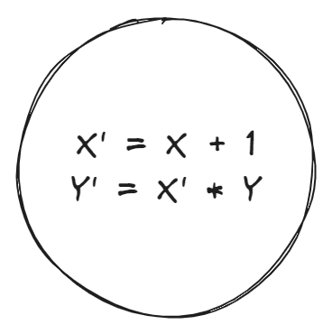
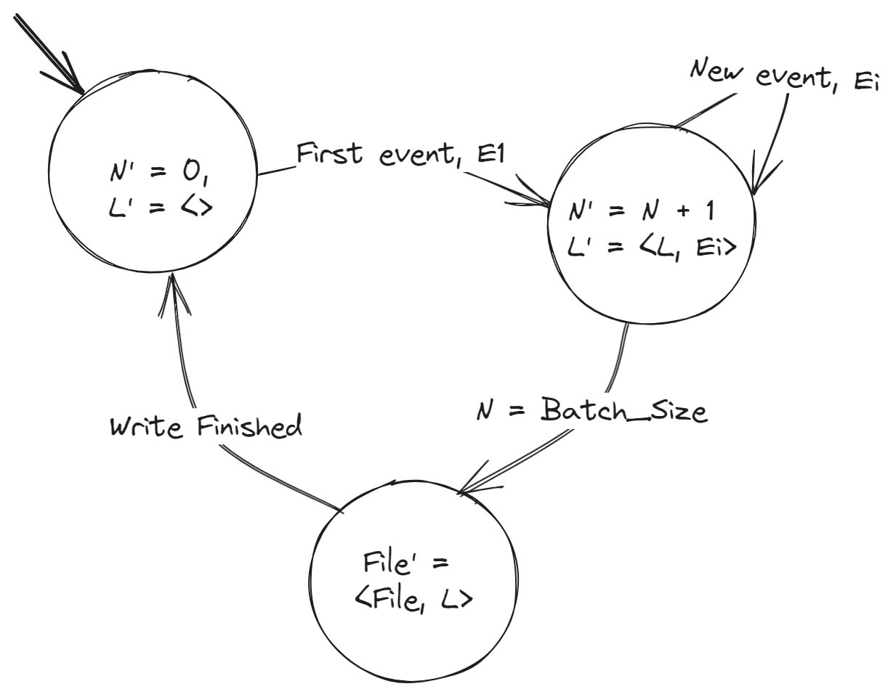
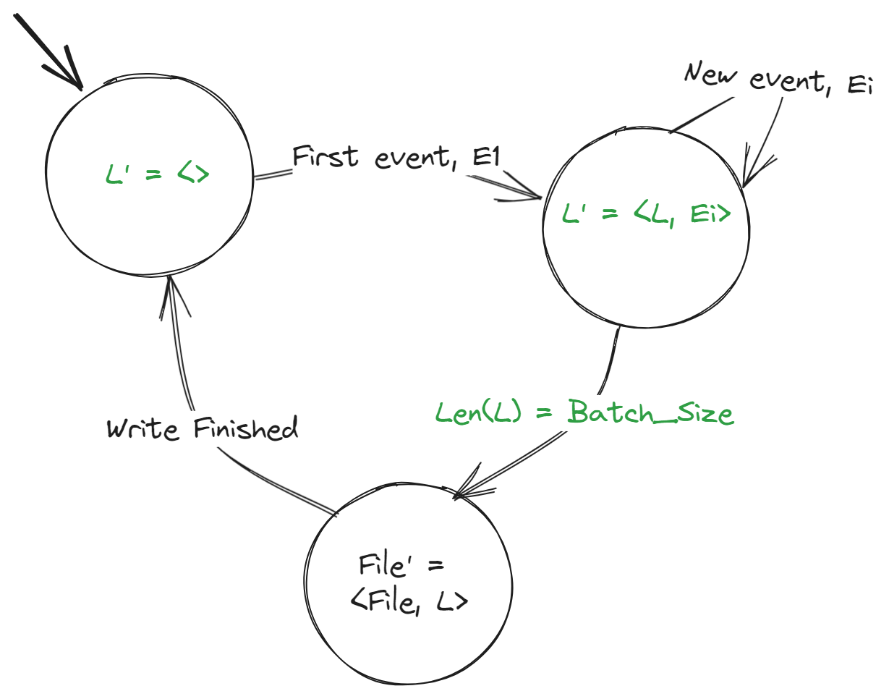
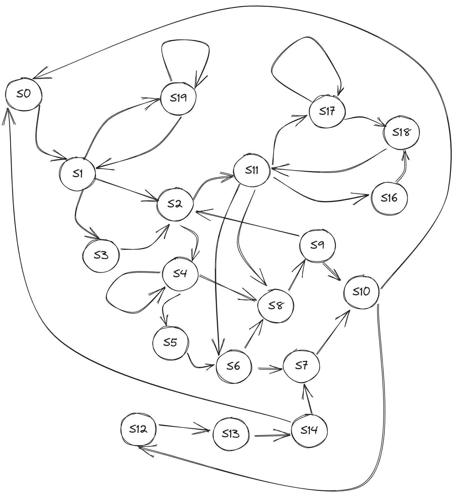
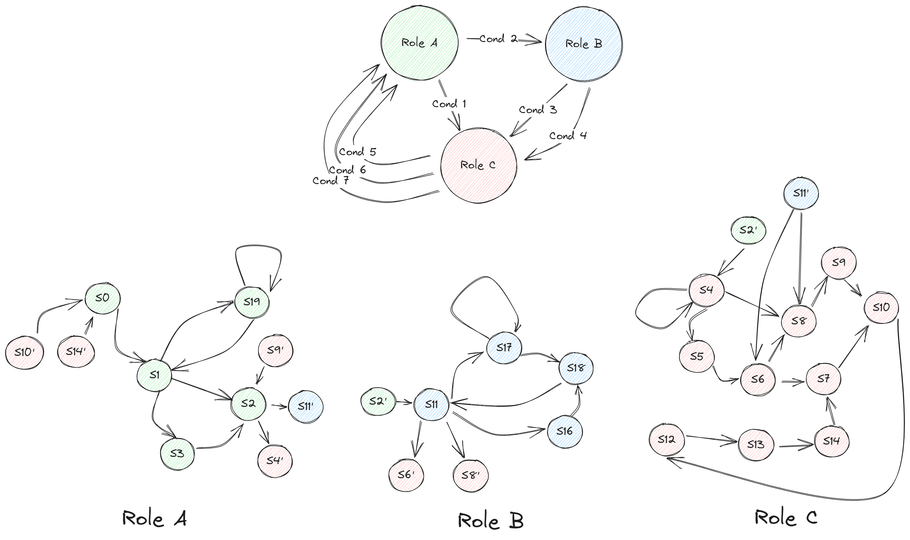

# Reverse Engineering for the Good: From the Source Code to the System Blueprint

## The Roots of Reverse Engineering and the Explanatory Mindset

Reverse engineering in the public discourse refers to semi-legal practices of deconstructing a product to extract its design blueprint. This applies to the software product as well. In case of software, this process includes reconstructing design and algorithms from binaries. This is not the kind of reverse engineering that I’d like to address in this article. Instead, I’d like to focus on the special kind of reverse engineering that we, software engineers, have to deal with, willingly or unwillingly, on a daily basis. I mean our efforts to understand how the software works on the conceptual level, what it does, and why it was shaped in this specific way.

The major part of the reverse engineering efforts lies in reading and understanding the code. However, reverse engineering is way more than that. In addition, it produces various artifacts that you, as an engineer, your colleagues, and even other teams could use to navigate the software systems better and to be able to modify them without breaking. This improved understanding is something that could lead both to improved outbound communication to build more trust with the users of the software and to visualizing technical tradeoffs that were taken at some point in the past and that you have to abide by or maybe reconsider if the circumstances changed or the use cases of your system evolved and maybe got broader.

People rarely talk about reverse engineering in this latter sense although this is, without a doubt, a critical skill when it comes to developing enterprise software systems and libraries used in production systems. This skill is overlooked by the classical academic curriculum and has to be acquired on the job or by contributing to the open source software projects. Quite frankly, there is no surefire method to acquire this skill and to get better at it. Any software engineer (unless he constantly jumps greenfield projects) has to figure out her own way of unveiling the inner workings of the software that she is assigned to develop or maintain. What definitely helps is to start using the system and to poke around it by changing various pieces of code and then discover how its behavior changes. Although this might not seem as systematic as one would hope it would be, this approach has worked pretty well so far for most of us.

Could one skip reverse engineering a system that does have fairly comprehensive and clear documentation? You can do so at your own risk. Reverse engineering in and of itself is a very useful and satisfying exercise that allows software engineers to understand the interdependencies of modules deeper, and, on top of that, it allows us to discover why this or that engineering decision has been taken. These parts can barely be represented in the documentation. Keeping these up-to-date is also a huge challenge. I’d argue that understanding the reasons behind the specific implementation is the crux of reverse engineering. Why is that? Well, because one gets down to the list of requirements that explicitly, or, what’s more important, implicitly, led to the software being implemented the way it is. In some sense, this is akin to an archeological task of reconstructing the software requirements specification (SRS) based on the code.

Having requirements distilled, one can track which ones fit nicely together and which may result in a design tradeoff. For the sake of clarity, imagine that during your deep dive into the source code of some software system you’ve discovered that it replicates certain kinds of data. You can deduce that the use cases for this system require it to be fault-tolerant and available in the sense that a crash of an instance of that system would not render the whole deployment unusable and at the same time, even if the node never recovers, the data will still be preserved. When done digging a bit more, you realize that every read operation waits for the majority of the replicas to respond. Wow, isn’t it a contradiction? Doesn’t it sound like a reduction in availability? Indeed, it is. Say, if the majority of nodes goes down or gets separated from the rest of the system, the system won’t be able to read or modify the data. However, this does not affect the capability of the system to tolerate the node crashes in a sense of data not being lost. Why would waiting for the majority to perform operations even be required? This is likely due to the use cases that require the system to offer a high level of consistency between replicas of the data. One could imagine this behavior to be quite beneficial for financial organizations like banks where the cost of data inconsistency is monetary.

Finding such requirements and formulating them clearly to spot the contradictions is rarely achieved by just looking at the source code. The engineer has to perform a deliberate and highly focused mental trip that starts in the code and then to climb up the abstraction ladder mercilessly splitting what is not relevant to the logic being reconstructed. Along this way, one produces a sequence of explanations of what, how, and why the source code really does.

One usually starts with a fairly complex explanation and gradually peels off more and more details to simplify the explanation. Naturally, this leads to the loss in accuracy the further along one is in this process. On the positive note, the capability to produce simpler and coherent explanations helps the engineer to form better understanding of the software system. A sophisticated reader might recognize here an approach popularized by Richard Feynman and developed further by David Deutsch in “The Beginning of Infinity”. I’d go as far as to actually proclaim that reverse engineering requires one to have an explanatory mindset, that is, wanting and being able to discover or forge explanations of various phenomena.

> reverse engineering requires one to have an explanatory mindset

But enough of philosophy. Let’s proceed to the practical tips on how to reverse engineer a software system.

## A Bird’s Eye View on Reverse Engineering the Software Systems

In most of the common programming languages one would encounter the following cross-cutting concern that gets in the way of reverse engineering and that has to be cut off as long as it is not in the spotlight of the analysis - performance optimizations. Performance optimizations, as you might have guessed, aim at improving the overall performance of the system. Performance itself is pretty much an umbrella term that can be viewed from the application performance perspective (throughput in operations per second, latency of each operation, etc) and the resource perspective (CPU usage, memory usage, disk throughput, etc). Sometimes, both aspects could be joined to form a bit more comprehensive characteristics like throughput per 1% percent of CPU used. In addition, they may be expressed as a monetary cost in SaaS and IaaS offerings.

Optimizing performance in the source code boils down to implementing some kind of ‘better’ resource management. The ‘better’ part here stands not for something that is necessarily ‘universally better’ but for something that is perceived as better for the use cases of this specific software system. If, for instance, the use case puts a premium on reliability of the data, more intensive disk usage and higher CPU utilization might come as an additional price to pay since the system will try hard to pack all the critical operations into transactions that persist the data to the stable storage. On the other hand, if the use case demands to push operation latencies as low as possible, high memory usage should not be a surprise since the latency/size ratio for RAM makes it appealing for caching that hides expensive disk operations.

Thus, the first step on the path of reverse engineering is to carefully peel all the ‘unimportant’ parts: caches, various encoding schemes that optimize memory usage, thread pools, transactions logic, and so on. On this step, one would have to pay special attention to the data structures. Instead of focusing on how the data structure works, one would have to consider which interface it offers. By interface here I mean the set of operations that the surrounding code depends on to perform its piece of job. One could imagine using a B-tree or a trie to map some keys to some values but in the end what matters to the description of the system is that a specific key maps to a specific value (or a set of values) and that this value can at any time be retrieved using this key. Bringing this explanation a step further, one could represent this mapping as a discrete function. However, this level of representation is rarely needed and can be, in a sense, too abstract so that the context of the specific use of the data structure is lost.

In the remaining part of the article I describe a few tools/approaches that I personally find very useful for the exercise of reverse engineering a complex codebase. Feel free to leave it or take it. Those have proven to be very useful in my work. These tools are arranged in order of decreasing the level of detail with occasional twist towards specifics of reverse engineering for distributed systems.

The tools and techniques are roughly split into two categories. The first one is the tools used when one starts with some code snippet and has to build their way up on the ladder of abstractions. The second one is the tools used when one needs to glue descriptions of multiple code pieces together into a coherent system description. It is appealing to name this second category the tools for reverse engineering the architecture. Since the use of the term architecture is opinionated beyond any reason, I’d leave it up to the reader to get along with this name or to simply refer to these tools as ‘second category’ or ‘tools up the abstraction stack’.

## Reverse-engineering for the Code Fragments

### State Change Diagrams

You might be familiar with state diagrams from your university years. There, you might’ve encountered them in the compiler design or computation theory classes. Although this tool has a very ‘academic’ flavor, it can, in fact, be repurposed to conduct the first analysis step on the path to understand the codebase. The academic literature frequently focuses on the state of the program which allows to get very comprehensive descriptions but would mostly be applicable to the well-scoped algorithms with firm boundaries. Unfortunately, this is not frequently the case in most of the practical software systems. So, instead, let us focus on the state of the data when showing how the state diagrams can be applied to reverse-engineering the software systems.

> In the software systems domain, one sometimes refers to the data as state. This is quite misleading in the context where we discuss how the pieces of data change their values which can also be referred to as state (state of the data). In addition to that, there is also the state of the program which includes both the data and supportive register values like program counter etc. As you can see, the term state is overused. Hence, in this text we will refer to the state of the data unless stated otherwise. You can imagine some variable, let’s say X, which changes its state (aka value) from 0 to 1 and then to 10 or something like that.

Before heading off to drawing circles and arrows, a hallmark of such diagrams, it is customary to find which data the program modifies during execution. Usually, this is an easy task for most programming languages. You need to look no further than the coded data structures. Most importantly, be on the lookout for the data structures whose lifetime does not end with the method call. Although local variables might be useful to understand how the algorithm works, they are frequently there only for the sake of developer’s convenience or for the sake of optimization. Presence of these local variables on your diagrams will likely bloat them so try to keep these away as much as possible or prune them when you refine your diagrams iteratively. All in all, class variables might be the best place to start if the codebase happens to follow the object-oriented paradigm (OOP).

Not all the data is created equal. Upon discovering all (or the majority) of pieces of data, you would likely need to filter out those that perform some supporting function like maybe some compare-and-swap primitives serving to organize accesses to the piece of state shared across multiple threads. I call this negative filtering since one focuses on removing what is unnecessary. Those removed pieces might still be interesting to consider when talking about performance and safety but they are fairly orthogonal to the task of initial understanding of what the code actually accomplishes for the use cases of the system. Once you’ve done pruning, you would likely discover that the final list of the data is not very long. Indeed, most of the data manipulation tasks that the code performs require just a handful of data structures, possibly, various sorts of indices or intermediate representations.

You may as well arrive at pretty much the same list of data entities with positive filtering by focusing on keeping the data that is (possibly, through a long chain of operations) transformed into the user-visible data. Personally, I don’t like using positive filtering in isolation since it may drag along a lot of data that in the end has purely supportive function. In contrast, negative filtering propels one to always ask oneself a question of whether this specific data structure should really be represented in the diagram. Remember that you can never overdo the removal part. If by pure accident you’ve removed some critical piece of data from the consideration, you will discover it on the next step when trying to make sense of the state change diagram. Personally, I find it better to add details on later stages than end up with a barely readable diagram.

Another important piece of data in the system that you don’t want to overlook is the one persisted to the disk. Actually, the persisted data might be the most important in the system from the business point of view. Its presence on the disk means that the use cases care about the durability even though persisting to disk is more expensive than keeping the data in main memory. Such data must also be included into the diagram.

Once you’ve found the most important data structures/entities, it becomes really helpful to think of the program as something that mutates or changes the state of this data. Essentially, all the coded operations serve the purpose of modifying the state of the data in some way. An operation may update only one variable or multiple at once, i.e. atomically. Ideally, you’d want to group logically related operations even if they change multiple variables at once and even if they are not, strictly speaking, atomic.

You then draw some shape around these grouped operations on multiple data items. Personally, I prefer circles, but it could be a rectangle or something else like a cloud - whatever is more readable for you and/or your team. If you happen to have multiple data structures/variables changed, then you may explicitly bring them into the diagram. This would make your ‘states’ (grouped operations with a shape around them, e.g. a circle) in the diagram look more like basic blocks used in compiler design but, well, such a notation serves us well-enough.

You may also want to distinguish between the past and the future in your grouped and encircled operations. Usually, it can easily be deduced from the position of the assignment sign: everything to the left of it is the future state (i.e. after the operation on the right hand side is performed) and everything on the right side refers to the past state. However, if your logically grouped operations use modified values straight away, then it might make sense to somehow distinguish between them explicitly. Like many distributed systems practitioners, I prefer to add a tiny Ꞌ symbol next to the name of variable that represents its future state, like this: **NꞋ = N + 1**. The below picture shows how the **X** variable gets incremented and the new value of **Y** is computed based on the updated value of **X** and the current value of **Y**. You can see now why Ꞌ might be important in such diagrams.



If the piece of logic in one of the circles becomes too big to be meaningfully represented in the diagram, you can always denote it with some label like **S0** and write down the operations that occur in that group somewhere else. Personally, I’d rather go for a slightly bigger figure like a rectangle to avoid forcing the reader (most likely, myself) to look at multiple different places to understand the whole picture.

Some data state modifications might be conditional, i.e. something must have happened or some condition needs to be met in order for the state to get updated. Such conditions are a part of a so-called control flow.

You can see it on the diagram below, which is a state diagram sketch of a simple program that writes batches of events of **Batch_Size** size to the file. For whatever reason, the original program uses a separate variable called **N** to track the number of events in the list. It first performs the operations in the circle pointed at by the hanging arrow (notation used to recognize the starting state of an automaton), that is, it assigns zero to **N** and initializes the list **L** of events to be an empty list. Upon arrival of the first event **E1**, the program performs an increment on **N** and appends this first event to the list **L**. Then, the self-loop in the diagram signifies that upon getting new events, the same operations are performed, namely, the length of the list is incremented and the new event is appended to the list. Once the length of the list becomes **Batch_Size**, the diagram shows that the program proceeds to write the list **L** at the end of the file **File**, and, once the write is over, it returns to the initialization operations.



Since **N** is only used to track the length of the list of events, we should get rid of it since it does not add any value to the understanding of the piece of code. We can substitute it with a call to some function Len that returns the length of the list. Note that it is possible that the programming language and its libraries do not offer such a function at all. Regardless, we do not strive to represent the code 1-to-1 in these diagrams. If we wanted a 1-to-1 mapping, we would simply skip drawing any diagrams since the code is already there. Therefore, do not be afraid to lose precision when drawing these diagrams. State diagrams should reflect the logic of the underlying process, the algorithm, rather than be an accurate graphical representation of the code.

In our diagram new events are appended (added at the very end) to the list **L**. The use of a particular data structure (such as a list or an array) might be dictated by the application or performance requirement, or by both. If it is there only for the performance reasons, then try your best to find the most generic structure that keeps the same application-relevant properties such as uniqueness of the elements or the order in which they are traversed. In the diagram below we might have wanted to substitute the list **L** for something more generic, like a set. However, switching from a list to a set in this case would not be a simple matter of performance. The list gives us an additional ordering guarantee which might be crucial in the context of reconstructing the temporal order of events later on. Moreover, the list does not require its elements to be unique, unlike a set. Hence, this list can be viewed as a sequence of non-unique events, and, if these properties are important in the context of the application, then one should avoid substituting the list for another structure. On the other hand, being more specific, like whether it is a singly-linked or doubly-linked list or whether it is a blocking structure or not, won’t be of much help in clarifying the purpose of the software so these details can often be omitted.



> In case you want to avoid implementation specifics, you may prefer to use sequence instead of a list. However, try not to overdo it since you still want these artifacts to be useful to your colleagues that might not necessarily want to speak high-level abstractions. Remember: too much abstraction may undermine the clarity of your explanation!

If you study the state diagram that we’ve produced so far, you might spot a bug (or, rather, a design flaw). If the software that this diagram represents can be used in applications that have only a finite number of events, then it might happen that **N - Batch_Size** last events will never be written to the file and will hang out in the main memory until the machine is powered down or the application crashes. Your inner voice may suggest you fix that by adding a timeout like on the diagram below. But do remember my warning - **_DON’T try to fix bugs/design issues while doing reverse engineering_**! Note the design issue down for later and ignore it. Regardless of how much accuracy you remove from the diagram in comparison to the source code, it should NEVER contain anything that is not in fact a part of the existing design, so, in simple words: **_you are allowed to remove but you are not allowed to add_**. Adding something which is not actually a part of the codebase is akin to ChatGPT hallucinating software libraries that never existed or books and papers that were never published. Basically, you are a sculptor working on a block of marble trying to reveal the figure hidden inside it. You can only do this by removing the excess marble but you cannot add more of it. The purpose of reverse engineering is to reveal what is hidden, not to invent something new.


You might start your dive into the code by rigorously noting down all the operations on all the variables and then find yourself tete-a-tete with the crammed diagram like the one below. Well, it’s just 20 circles and a handful of arrows but it could be 50, 100, or more… To top that, imagine all these arrows to be in fact labeled. Analyzing such diagrams could get daunting and would likely get you confused instead of providing a clear picture of what’s going on in the code.



But what if all these states are indeed a required part of the business logic? What if you have reached the point where you cannot shed any more of these groups of operations and arrows without sacrificing the correctness of the diagram? Unfortunately, sometimes a piece of code may attempt to do way more than it should. This haziness of the code is likely a sign of hidden abstractions, that is, abstractions that have not been spelled out but which determine how the implementation is structured and evolves. How can we deal with the diagrams that got bloated because of this?

Personally, I try very hard to split complex state change (transition) diagrams across the semantic dimensions present in the code. One of the most useful semantic dimensions in my practice is the dimension of performed roles. One can understand this intuitively by imagining the software as performing multiple roles like Data Storer (code that is responsible for storing the data), Data Replicator (code that is responsible for replicating the data), Notificator (code that is responsible for notifying other subsystems). This allows us to speak about the same code in its different roles which narrows the focus of technical discussions. Introducing such roles explicitly in the code itself might not even be required since it frequently adds complexity and might not fit well with the rest of the classes. However, for the purpose of building higher-level abstractions, role distillation may yield very helpful results.

With the roles figured out, a diagram might be split into multiple simpler ones - one for each role. Below, we can see the previous complex diagram being split into three roles that have multiple transitions between them. The corresponding state change diagrams for each role contain the connected state from another role marked with Ꞌ. Having these states interspersed into a different role helps to contextualize the state transitions within the role and how they depend on another role. This is particularly useful to describe the operations that transform the state and precede the transition into a different role, like, for example, filling up a buffer to send as a Data Bundler and then proceeding to send it as a Reliable Sender.



Once we are done with the low-level state transition diagrams, we may proceed to spell out what algorithm these diagrams (or parts of them) represent. We’ll do so with pseudocode.

### Pseudocode

Chances are that you are quite familiar with pseudocode if you’ve studied computer science/computer engineering or encountered some research papers/books on algorithms and data structures. You may wonder why pseudocode comes after the state transition diagram. Why wouldn’t you want to gradually abstract the details by writing down pseudocode that focuses on the most important pieces of data and logic and then express it as a diagram for a better understanding?

First of all, the order in which you create these representations is a matter of perspective and taste. However, my personal take on starting with the state transitions diagram and then proceeding to the pseudocode is that pseudocode then gets compact and focused. This comes in very handy on the latter stages and also when you consider redesigning your software system. Concise pseudocode snippets can be implemented in the program code without all the bells and whistles of the original implementation and thus can serve as a ground to experiment with different concepts, data structures, algorithms, etc. Concise pseudocode would bring clearer communication since, on one hand, it does not bring the unnecessary complexity with it, and, on the other hand, your teammates might have an easier time studying the pseudocode and transforming it into the real implementation than wrestling with the elaborate diagrams.

When talking about pseudocode, it is very useful to pay attention to the algorithms that use some kind of computations and not simply move the data around or perform search operations over it. If the code that you reverse-engineer contains computations that are more than usual counting (incrementing, decrementing), then it makes a lot of sense to restore the mathematical formula behind these computations. This formula should then be placed into pseudocode substituting for the sequence of actions used to compute the end result. Consider the following pseudocode snippet:

```
mean := 0
for eventsCntPerGroup in eventsCountsTotal:
  mean += eventsCntPerGroup

mean := mean / groupsCnt
```

Although this is not a lot of lines, the idea of the mean events count per group is obscured by the implementation details. In contrast, the formula is compact:

$$mean = {\sum_{groups} e_{group} \over n_{groups}} $$

Essentially, you sum the event counts over all the groups and divide the result over the number of groups. Such a formula is easily readable and allows one to clearly visualize how the data state (variable mean) would change depending on the changes in its constituents (number of groups and events per group).

Formulas better capture the behavioral aspect of the application and sometimes they might be way more expressive than the pseudocode. However, as with every explanation, try not to overdo it and take into account how well-versed the reader of your explanation is in math. You could probably expect some understanding of the basic concepts in mathematical statistics and of basic mathematical operations like summation and product. More complex concepts like integrals and differentials might require some written clarifications. One can also add a graph that explains the relation captured by the formula or explain it using textual description or an example. There are plenty of tools like [Desmos](https://www.desmos.com/calculator) that allow one to visualize formulas and play with parameter values.

## Conclusion of Part I

I’d like to draw a line for this lengthy first part of the article here. In my opinion, state change diagrams and pseudocode are essential and at the same time sufficient to get a fairly good understanding of what various bits and pieces of the codebase try to achieve. Although these representations will get you far in analyzing and improving some well-scoped parts of the codebase, unfortunately, they won’t provide you with the holistic picture of how all these fragments fit together and what impact the change in one of these fragments incurs on the rest of the system. The second part of the article will share my experience and tools in extracting the system blueprint and requirements that are desperately needed when performing large-scale changes to your codebase.
